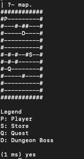

# TubesLogkom - Baca yaa, edit Shifa
Membuat sebuah survival role-playing game di dunia baru sebagai seorang programmer dengan menggunakan bahasa pemrograman deklaratif GNU Prolog.

How to run sementara:
1. Run yang main.pl di gnu
2. ketik command start.
3. ketik map. buat ngeliat map  
  
4. a. s. w. d. buat gerak gerak

